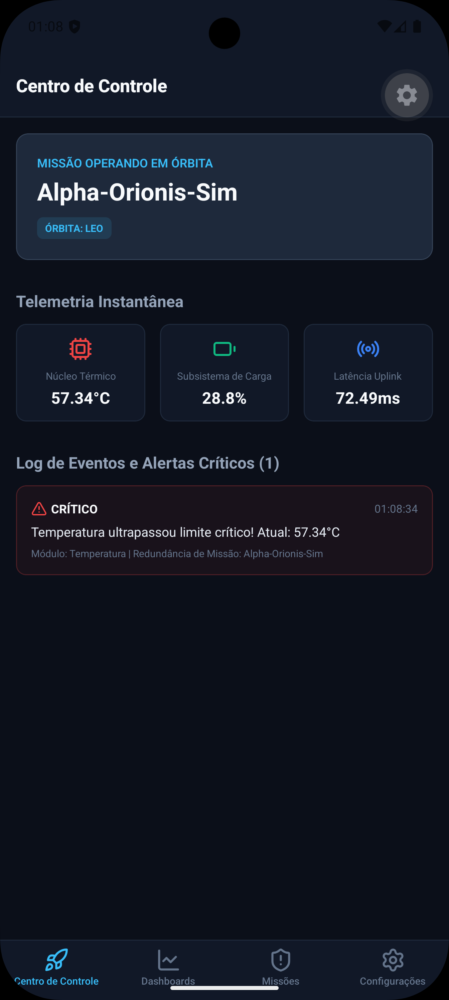
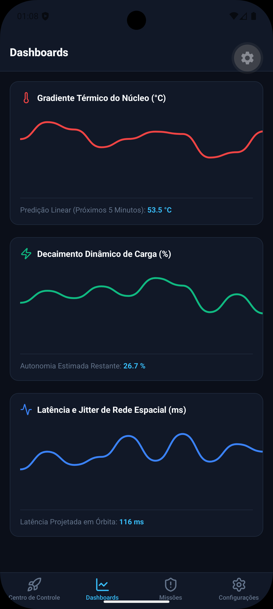
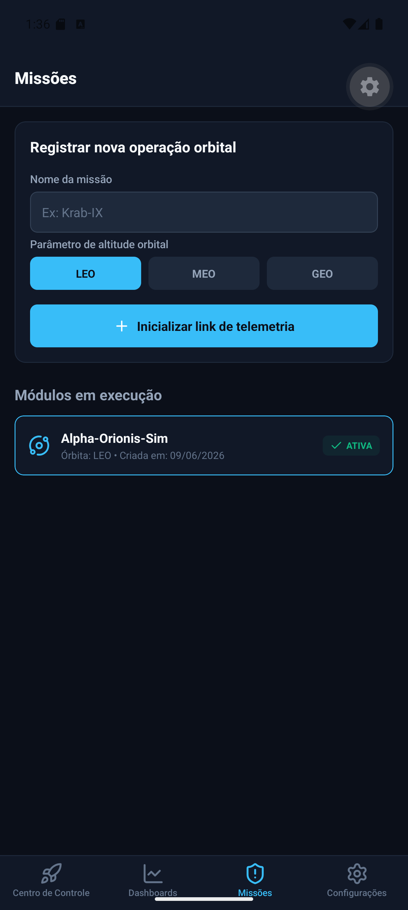
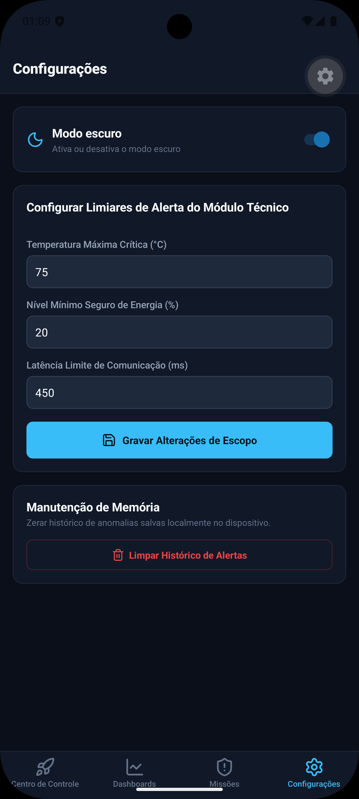

# SpaceMonitor

> Sistema inteligente para monitoramento de telemetria, análise de estabilidade e predição de anomalias em missões espaciais.


---

## Descrição do Projeto

O **SpaceMonitor** é um aplicativo mobile completo desenvolvido para atuar como um Centro de Controle de Missões Espaciais portátil. Ele resolve o desafio crítico de centralizar, analisar e prever falhas em sistemas de satélites artificiais operando em múltiplas órbitas simuladas (LEO, MEO e GEO). Através do monitoramento em tempo real de vetores de temperatura, potência de bateria e latência de downlink, a plataforma utiliza inteligência computacional para gerar alertas preditivos de degradação antes que as falhas estruturais aconteçam no subsistema simulado.

---

## Integrantes

| Nome do Integrante | RM |
| :--- | :--- |
| Gustavo Hackime Costa | 563751 |
| Luiz Henrique Macedo Graça | 564704 |

---

## Demonstração Visual

### 1. Centro de Controle


*Apresentação imediata dos dados nominais vigentes, indicador da órbita sincronizada e linha de tempo com os alertas instantâneos e preditivos gerados pelo sistema.*

### 2. Dashboards Analíticos


*Interface equipada com 3 gráficos temporais distintos e cálculo matemático de tendência extrapolada.*

### 3. Criação de missões


*Formulário de cadastro validado de novos módulos satelitais simultâneos, permitindo a alternância rápida de escopo de monitoramento com reconfiguração limpa de cache reativo.*

### 4. Painel de Limiares e Preferências


*Ajuste dinâmico das variáveis físicas máximas e mínimas permitidas para o disparo de segurança e chaveamento nativo e imediato para o Dark Mode do app.*

---

## Funcionalidades Principais

- **Algoritmo Preditivo Local:** Implementação matemática pura de Regressão Linear Simples em TypeScript projetando tendências de degradação estrutural para os próximos 5 minutos.
- **Simulação Multi-Missão:** Engine reativa que isola telemetrias de diferentes satélites e órbitas simuladas em tempo real.
- **Atualização Periódica:** Coleta contínua de novos pacotes de telemetria atualizados a cada 60 segundos.
- **Persistência de Dados:** Armazenamento local completo para logs de anomalias críticos, configurações personalizadas de thresholds e preferências estéticas.
- **Ajuste Dinâmico de Thresholds:** Validação de inputs em formulário para modificação ágil das métricas operacionais máximas aceitáveis de segurança da missão.
- **Dual-Theming:** Suporte integrado a Tema Claro e Escuro, redesenhando a interface para ambientes de monitoramento 24/7.

---

## Tecnologias Utilizadas

- **React Native & Expo Router:** Framework base e roteamento nativo declarativo baseado em arquivos.
- **TypeScript:** Tipagem estática em toda a arquitetura para garantir blindagem a erros de runtime em dados críticos.
- **ContextAPI:** Gerenciamento reativo do estado global do ecossistema, injetando dados síncronos em todas as telas.
- **AsyncStorage:** Banco de dados embarcado para persistência local de dados e logs.
- **react-native-wagmi-charts & SVG:** Biblioteca de renderização visual de alta performance acoplada a gestos nativos para visualização temporal dos dados.
- **Lucide React Native:** Biblioteca iconográfica para ambientação do contexto aeroespacial.

---

## Como Executar o Projeto Localmente

Siga a cadeia de passos documentada abaixo para clonar e executar o ambiente simulado no seu computador.

### Pré-requisitos
- **Node.js** instalado
- **Git** configurado
- Gerenciador de pacotes **npm** ou **yarn**
- Aplicativo **Expo Go** instalado no seu smartphone (iOS ou Android) para testes em dispositivo real.

### Passos de Execução

1. **Clonar o Repositório:**
   ```bash
   git clone https://github.com/IAmIndex/fiap-cpad-gs1
   cd space-monitor
   ```

2. **Instalar dependências de produção:**
   ```bash
   npm install
   ```

3. **Iniciar o servidor do Expo:**
   ```
   npx expo start
   ```

Para rodar a partir deste ponto, é necessário utilizar um emulador de celular. Utilize aquele de sua preferência. Basta seguir as informações disponíveis [aqui](https://docs.expo.dev/get-started/set-up-your-environment/).

**Importante:** Utilizar o aparelho físico pode não funcionar, já que o Expo está em uma versão mais antiga nas lojas de aplicativos.

# Vídeo Demonstrativo

Para assistir a uma demonstração do aplicativo em seu funcionamento, acesse [este vídeo]().

# Adendo

Os dados utilizados no aplicativo são 100% simulados e não vêm de nenhum sensor real. Todos os números são gerados por fórmulas matemáticas.
